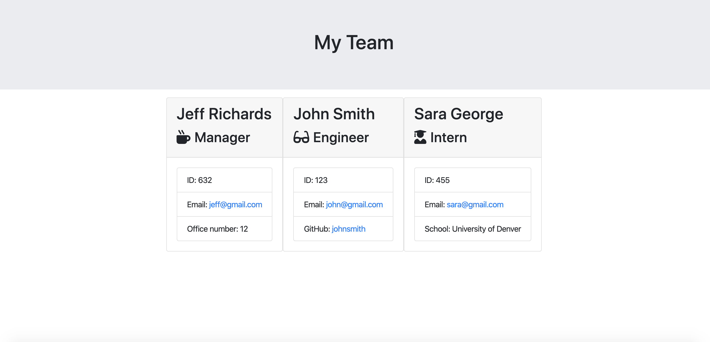
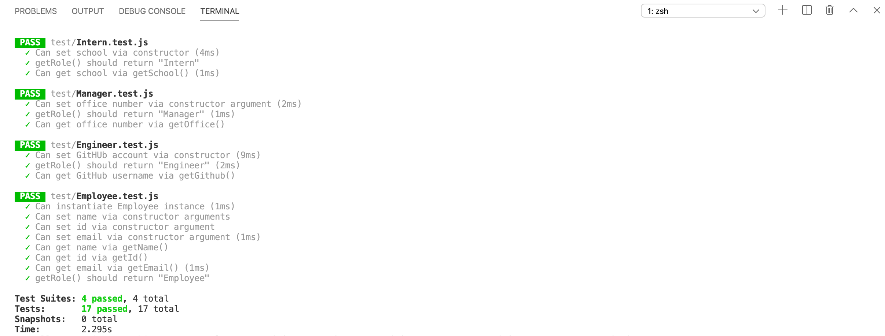

Template Engine - Employee Summary  

Description: This is a Node CLI that takes in information about employees and generates an HTML webpage that displays summaries for each person.  

The application prompts the user for information about their role in the command line, utilizing the npm "Inquirer" package.  

It is then rendered using templates and displayed in the browser.  

  

Tests are run, utilizing npm package "Jest", to ensure accurate code.

 

Built with:  
Visual Studio Code  
Javascript  
Node.js  

Authors:  
Ilana Shaffer  

Acknowledgments:  
University of Denver - Bootcamp Spot Assignment
